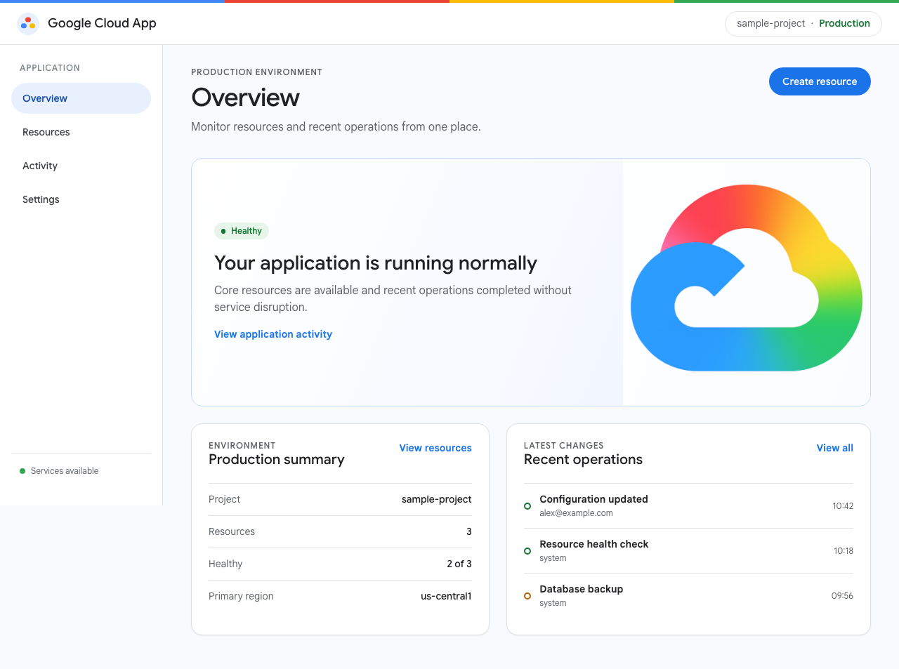
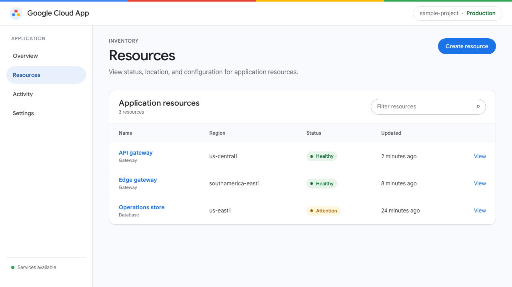
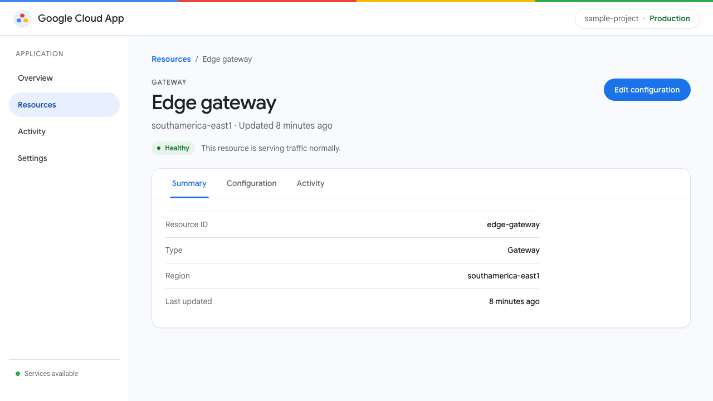
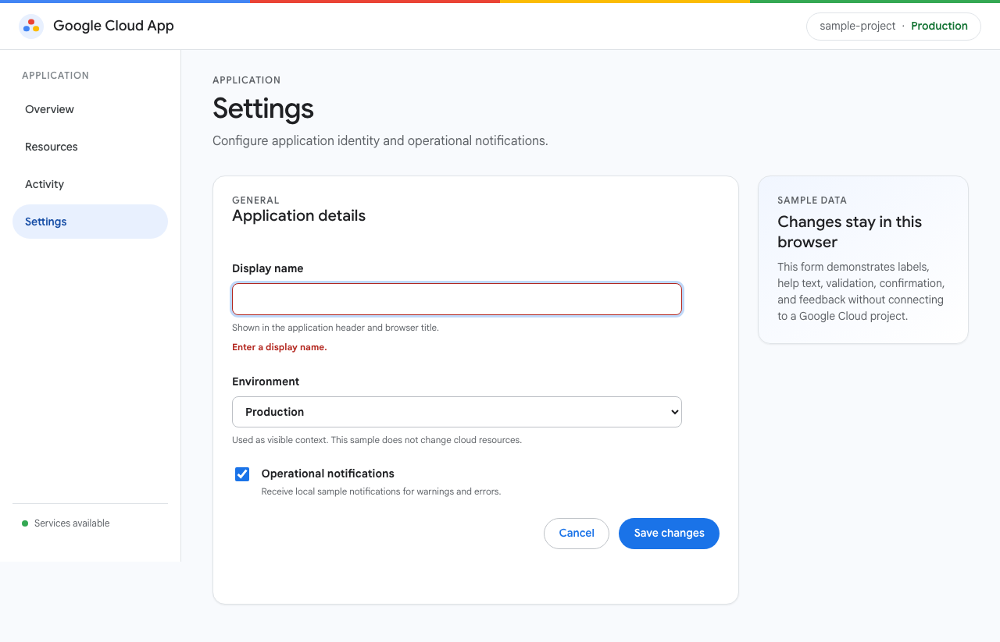
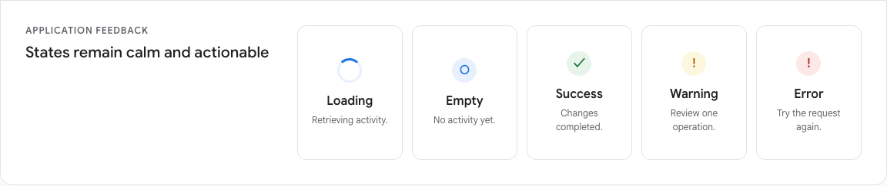
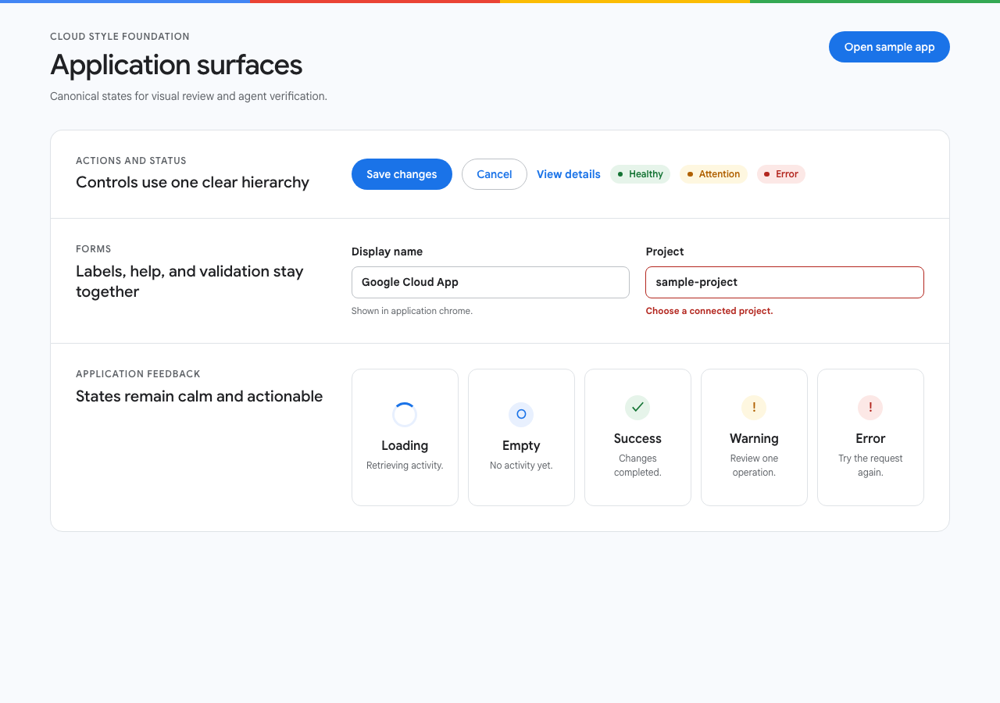
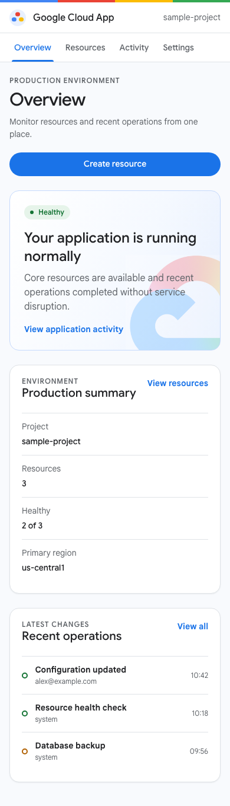
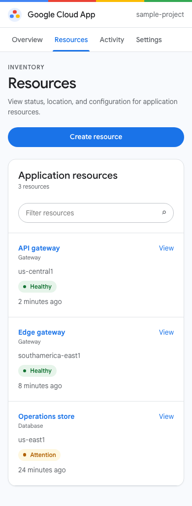

# Cloud Style

Cloud Style is a framework-free foundation for applications that should feel native to Google Cloud. It provides one neutral sample application, reusable visual contracts, Antigravity workflows, and automated visual verification.

The sample is intentionally ordinary: Overview, Resources, Activity, Settings, a resource detail route, application states, and a validated form. Replace what your product does while preserving how the shell, hierarchy, states, and controls work.

| Overview | Resources |
|---|---|
|  |  |

| Resource detail | Settings & validation |
|---|---|
|  |  |

| Activity feedback states | Component surfaces |
|---|---|
|  |  |

| Mobile overview | Mobile resources |
|---|---|
|  |  |

## Run the sample

```powershell
python -m http.server 8000
```

Open [http://127.0.0.1:8000/index.html](http://127.0.0.1:8000/index.html).

No build step is required. The app uses semantic HTML, CSS custom properties, vanilla JavaScript, and hash routes.

## Start a new application

1. Change product identity and navigation in `js/config.js`.
2. Replace deterministic sample records in `js/data.js`.
3. Remove sample routes the product does not need.
4. Add focused screen renderers under `js/screens/`.
5. Keep shell, token, action-hierarchy, focus, and state contracts intact.
6. Run the verifier and inspect the screenshots.

For an Antigravity-ready procedure and copyable prompts, see [docs/ANTIGRAVITY.md](docs/ANTIGRAVITY.md).

## Apply it to an existing application

Inventory the application's framework, routes, state, public interfaces, components, and tests. Introduce the token layer and shell contract without replacing the framework. Convert one representative route, verify that its behavior is unchanged, and continue incrementally.

Do not copy the sample's data model into an existing product. Cloud Style supplies visual and interaction contracts, not product architecture.

## Repository map

| Path | Purpose |
|---|---|
| `index.html` | Sample application entry point |
| `components.html` | Canonical component and state evidence |
| `js/config.js` | Configurable identity and navigation |
| `js/data.js` | Local deterministic sample data |
| `js/app.js` | Application shell and route mounting |
| `js/screens/` | One renderer per supported route |
| `css/tokens.css` | Google Cloud color, type, space, and motion tokens |
| `css/cloud-style.css` | Base elements and shared components |
| `css/shell.css` | Header, navigation, and content shell |
| `css/screens.css` | Screen workflows and component evidence |
| `css/responsive.css` | Mobile and wide-screen behavior |
| `tools/verify.py` | Playwright runtime, responsive, and screenshot checks |
| `docs/screenshots/` | Canonical visual evidence |

## Verify changes

Install the pinned browser dependency once:

```powershell
python -m pip install -r requirements-dev.txt
python -m playwright install chromium
```

Run:

```powershell
python -m unittest discover -s tests -v
python tools/verify.py --update-screenshots
python tools/verify.py
```

The verifier checks primary routes, resource filtering, deep links, tabs, activity states, settings validation, confirmation, mobile overflow, visible focus, reduced motion, browser errors, and canonical screenshots.
