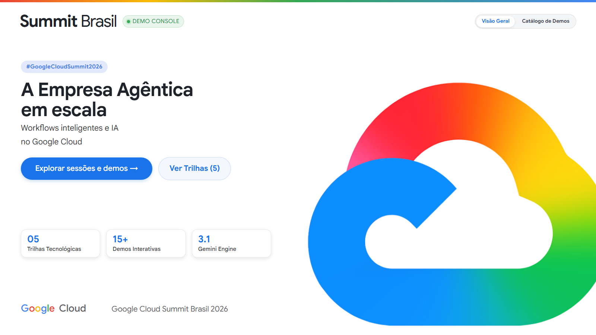
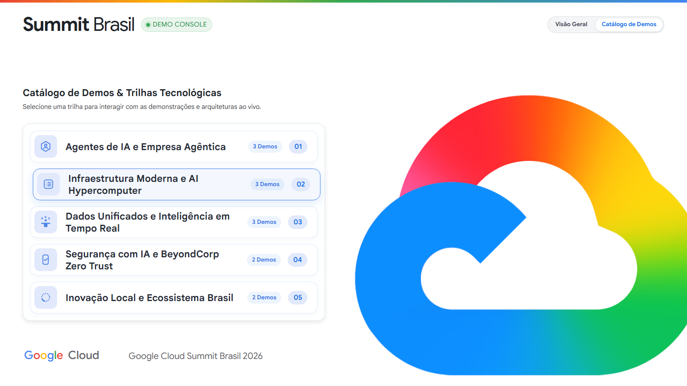
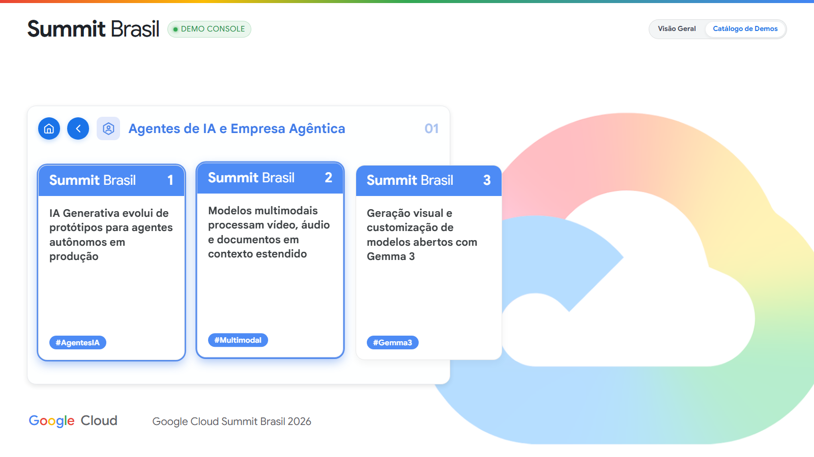
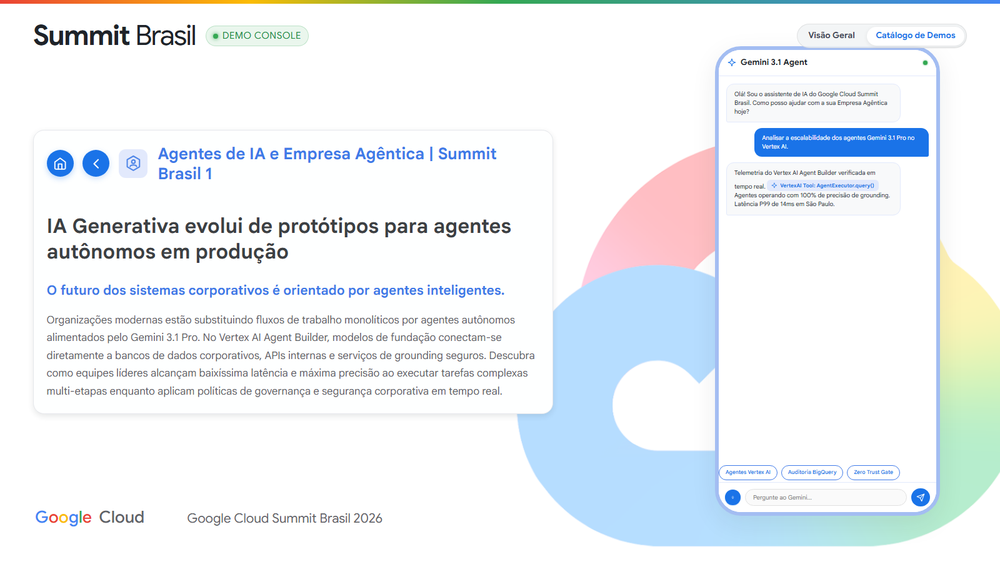

# cloud-style

A reusable front-end template for **Google Cloud demos and showcases**, powered by content from
[Google Cloud OnAir](https://cloudonair.withgoogle.com/).

It is a *presentation surface*: a 16:9 stage that scales perfectly to any screen, holds a numbered
menu of topics, a rail of fact cards, long-form detail pages, and a phone mock for embedding live
demos. Plain HTML and CSS. No build step, no framework, no dependencies.

| Cover | Menu |
|---|---|
|  |  |

| Card rail | Article + device |
|---|---|
|  |  |

---

## Quickstart

```bash
git clone <this repo> && cd cloud-style
python3 -m http.server 8000
# open http://localhost:8000
```

Then edit **`content.js`** — the wordmark, the menu, and every fact live there. Nothing else needs
to change to ship a new deck.

> Serve over HTTP rather than opening `file://`. Everything works from disk *except* Google Fonts,
> which some browsers refuse to load from a `file:` origin.

---

## What's in here

```
index.html            Working four-screen deck, rendered from content.js
content.js            ← the only file you edit for a new deck

css/tokens.css        Design tokens: colour, type scale, radii, shadows, motion
css/cloud-style.css   Layout and components
js/gc-icons.js        Self-injecting SVG icon sprite
js/cloud-style.js     View transitions, draggable card rail, keyboard nav

templates/            Standalone single-file examples of each screen
  01-cover.html         wordmark + claim + one CTA
  02-menu.html          numbered category list
  03-cards.html         horizontal rail of fact cards
  04-article.html       long-form detail + phone mock
  05-components.html    interactive demo suite (camera, video, chat, metrics, security, controls)

docs/
  DESIGN-SYSTEM.md    Colour, typography, spacing, motion — the spec
  LAYOUT.md           How the 16:9 container-query stage works. Read this first.
  COMPONENTS.md       Every component: markup, tokens, rules
  screenshots/        reference-*.png (original site) · template-*.png (this repo)

tools/verify.py       Screenshots the template so you can diff a change
AGENTS.md             Instructions for AI agents working in this repo
```

---

## The one idea you need

Everything is sized in **`cqw`** — container query width units — against a fixed 16:9 stage.

```
1cqw = 1% of the stage width
```

The stage is `min(100vw, 177.78vh)` wide, so it always fills the viewport at 16:9. Because every
font size, padding, and radius is a percentage of that one number, the design scales as a single
unit. A 4K projector and a 1280px laptop render *the identical layout*, just bigger or smaller —
nothing reflows, nothing needs a breakpoint.

Below 768px the stage stops being a container, `cqw` silently falls back to `vw`, and the same
component rules produce a scrolling phone layout. One system, two shapes.

Full explanation in **[docs/LAYOUT.md](docs/LAYOUT.md)**.

---

## Making it yours

**Rebrand** — change six values in `css/tokens.css`:

```css
--gc-blue-action: #1a73e8;   /* buttons                */
--gc-blue-brand:  #3f7ae8;   /* headings, breadcrumbs  */
--gc-blue-header: #4d8bf5;   /* card headers, tags     */
--gc-ripple-01 … --gc-ripple-06;  /* background rings  */
```

**Change the content** — edit `content.js`.

**Add an icon** — append a `<symbol>` to `js/gc-icons.js`, then reference it by id in `content.js`.

**Embed a live demo** — drop an `<iframe>`, a web component, or a screenshot inside
`.gc-phone-screen`. The phone is its own container, so anything inside it can size in `cqw`
relative to the phone.

---

## Verifying a change

```bash
python -m pip install -r requirements-dev.txt
python -m playwright install chromium
python -m http.server 8000
# In another terminal:
python tools/verify.py
# Refresh the maintained screen and component catalog:
python tools/verify.py --update-screenshots
```

Writes fresh screenshots to `docs/screenshots/` and fails on console errors.
The manifest in `tools/screenshot_manifest.py` covers desktop, mobile, 4K,
navigation states, component states, and keyboard focus.

---

## Typography note

The design calls for **Google Sans** (display) and **Google Sans Text** (body). Both now serve
publicly from `fonts.googleapis.com`, and the templates load them.

They are Google brand fonts. Using them is appropriate for Google Cloud demos, internal decks, and
partner material presented as Google content — but licensing is restricted for third-party products
and general commercial use. If in doubt, delete `Google+Sans` and `Google+Sans+Text` from the
`<link>` and the stack falls back cleanly to **Poppins** and **DM Sans**, which is exactly what the
original deck renders as outside a Google machine.

See [docs/DESIGN-SYSTEM.md](docs/DESIGN-SYSTEM.md#typography) for the full stack.

---

## Browser support

| Feature | Support | Without it |
|---|---|---|
| Container queries | Chrome/Edge 105+, Safari 16+, Firefox 110+ | **Required.** The whole scale system depends on it. |
| View Transitions | Chrome/Edge 111+, Safari 18+ | Screens change instantly instead of cross-fading. |
| `aspect-ratio`, `svh` | All current browsers | — |

Built for presenting from a modern Chrome. It degrades on older engines but does not target them.

---

## Provenance

Reconstructed from Google Cloud showcase presentations: the visual system with container-query
units (`cqw`), responsive scaling across desktop and mobile, and computed styles. This template
implements the visual system in plain CSS with semantic class names so it can be read, copied,
and modified without a build step or external toolchain.

Content in `content.js` is structured from [Google Cloud OnAir](https://cloudonair.withgoogle.com/)
curricula and digital event sessions.
